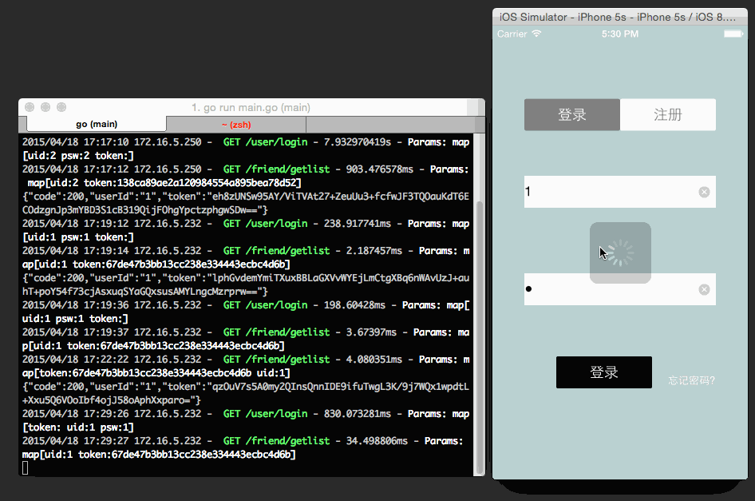

# STONE 

没试过IM通信的功能，接入融云的服务，自己写个简单后端接口，自己写个DEMO，加上一些小例子，短短续续的做着，挺耗费时间的。供大家参考。

#####Usage:
1.使用前，先运行我写的golang服务端。服务器的安装知识这里不介绍了。
	服务端接口例子,直接用一些工具模拟发送，例如：postman：
		127.0.0.1:1234/user/login?uid=2&psw=2
		127.0.0.1:1234/user/regist?uid=2&psw=3
		127.0.0.1:1234/user/refresh?uid=7&token=36255015fc087af7fc468dbcff08705b  // 刷新融云token用的，如果链接不上的话。
		127.0.0.1:1234/friend/getlist?uid=1&token=138ca89ae2a120984554a895bea78d52&fid=2 // 获取好友列表
		127.0.0.1:1234/friend/deletefriend?uid=1&token=67de47b3bb13cc238e334443ecbc4d6b&fid=2 //删除好友
		127.0.0.1:1234/friend/addfriend?uid=1&token=67de47b3bb13cc238e334443ecbc4d6b&fid=5 // 添加好友功能

2.接着修改配置的默认ip地址，直接在xcode项目中可以很快查到的。
运行程序。

###### 注意
添加好友的逻辑是：a先发送服务，由融云服务器推送到本地手机，然后b手机根据推送信息，进行自定义处理，最后，判断是否进行添加后，返回自己的服务器，自己的服务器再推送到融云服务器，在a手机上获取结果。（没准人家拒绝了，谁知道呢，还没做）

#####OK.Talk is cheap, show you the demo. 

